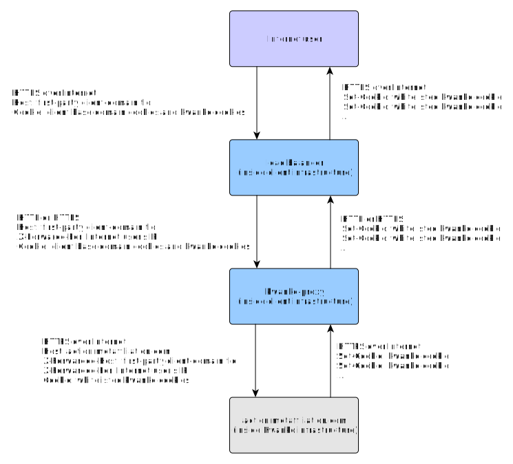

# Kwanko first-party proxy

## Synopsis

The Kwanko first-party proxy is an alternative to the classic first-party setup. It provides a cookie filtering proxy directly inside the client infrastructure.
It should be used when the client has critical cookies on its root domain and want to be sure that those cookies do not reach the Kwanko infrastructure.

This additional security comes with a price since it complexifies the setup and any future debugging by offshoring a critical element into the client infrastructure.

## Cookie whitelist

The following cookies are whitelisted:

* `neta`
* `neta_ssc`
* `netases`
* `netases_ssc`
* `netaoptout`
* `netaoptout_ssc`
* `metanotrack`
* `metanotrack_ssc`
* `cookie-policy`

In addition, cookies for which names start with the following words are whitelisted:

* `ct`
* `convbwr`
* `netattag`
* `kwk`

## Architecture

The proxy takes a request and modifies it in several points before sending it to `action.metaffiliation.com`:

* it sets the `X-Forwarded-Host` header with the original `Host` header.
* it optionally sets the `X-Forwarded-For` header with the source connection IP. This needs to be configured explicitely if the proxy is directly exposed to the Internet or behind an L4 load balancer.
* it overwrites the `Host` header with `action.metaffiliation.com`.
* it removes all cookies from the `cookie` header that do not match the whitelist.

The proxy also processes the response from `action.metaffiliation.com` before returning it to the Internet user:

* it removes `Set-Cookie` headers that do not set a cookie matching the whitelist.

Multiple instances of the proxy should be deployed to provide fault-tolerance.

The proxy trusts by default the content of the `X-Forwarded-For` header that needs to be set by an upstream load balancer. If the proxy is behind an L4 load balancer or directly exposed to the Internet, this header should be overwritten with the connection source IP (see the config files for the lines to uncomment).

## Implementations

Two implementations of the proxy are available based on:

* [Nginx](./nginx)
* [HaProxy](./haproxy)

## Monitoring

This critical element will be part of the client infrastructure. It means that the client is responsible for its availability.
As such, the client is responsible for montoring and, if ever needed, tuning the HaProxy or the Nginx instances.
